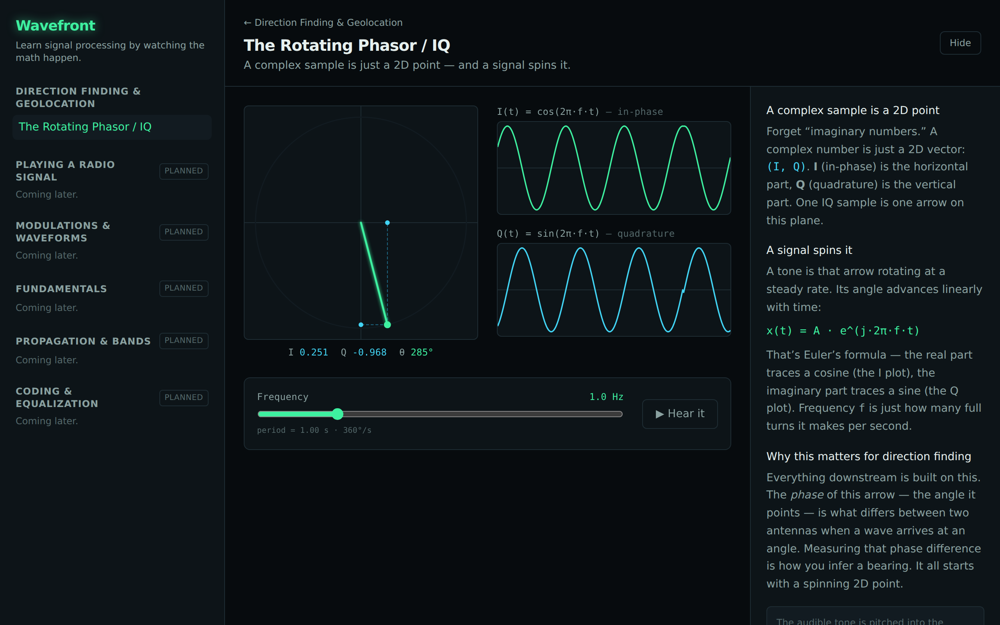
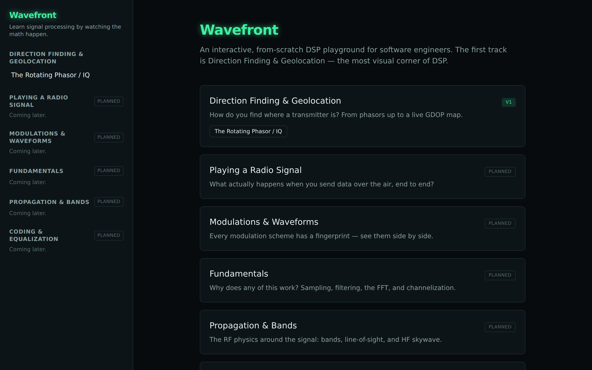

# Wavefront

**Learn signal processing by watching the math happen.**

Wavefront is an interactive, visually striking web app that teaches DSP to **strong software
engineers who are not electrical engineers**. The first track is **Direction Finding &
Geolocation** — the most visual corner of DSP — built on a small foundation of reusable,
**from-scratch** DSP primitives and visualization components.

> The signature interaction is **direct manipulation**: drag the emitter, drag a receiver,
> sweep a slider — and watch _everything_ recompute and animate in real time. That live
> feedback loop is the soul of the tool.



## What it is / who it's for

If "IQ", "phase", or "the complex plane" feel hand-wavy to you, this is built for you.
Everything is explained in software-developer analogies:

- A **filter** is just a function applied to a stream of samples.
- **Convolution / correlation** is a sliding dot product.
- The **FFT** is a change of basis — re-expressing a vector in different coordinates.
- An **IQ sample** is a 2D vector (a complex number); a signal is an array of them.

## Gallery

_Marquee scenes are captured automatically as the UI grows (`npm run screenshots` → `docs/images/`)._
The first slice — the **rotating phasor / IQ** module (above) — is the milestone that proves the
whole stack (rendering, audio, state, registry, design system, tests, screenshots).



## Quickstart

```bash
npm install
npm run dev      # start the app (Vite dev server)
```

Then open the printed local URL.

## What you can learn (track / module map)

| Track                               | What it answers                                                      | Status  |
| ----------------------------------- | -------------------------------------------------------------------- | ------- |
| **Direction Finding & Geolocation** | How do you find where a transmitter is?                              | 🚢 v1   |
| Playing a Radio Signal              | What happens when you send data over the air, end to end?            | planned |
| Modulations & Waveforms             | Every modulation scheme's fingerprint, side by side.                 | planned |
| Fundamentals                        | Why does any of this work? Sampling, filtering, FFT, channelization. | planned |
| Propagation & Bands                 | The RF physics around the signal (bands, line-of-sight, skywave).    | planned |

See [`docs/tracks/`](./docs/tracks/) for the per-track curriculum.

## Architecture

Wavefront is designed to grow into a broad "learn DSP from the ground up" platform. New modules
and tracks slot in via a **module registry** — adding curriculum is a registry entry, not a
routing rewrite. See **[docs/ARCHITECTURE.md](./docs/ARCHITECTURE.md)** for the full contract
and step-by-step recipes.

## Tech stack

- **React + TypeScript + Vite**, **Tailwind** (v4) for layout, design tokens for the
  "lab-instrument" aesthetic.
- **Canvas 2D / SVG** for crisp plots; **react-three-fiber / Three.js** reserved for dense 3D
  field moments (e.g. the GDOP heatmap).
- **Web Audio API** for the audible-signal moments.
- **Zustand** for lightweight state.

## Testing & the from-scratch-core philosophy

The DSP math is implemented **from scratch** in `src/dsp/` — no black-box library does the
conceptually interesting work (a fast FFT lib is acceptable only as an optimization behind a
from-scratch reference the tests check against). The `dsp/` core is covered by
**numerical-correctness tests** (Vitest): known inputs → known outputs, reference-vs-optimized
agreement, Parseval/energy checks, correlation-peak-at-known-lag, and closed-form spot checks.

```bash
npm test            # run the suite
npm run test:coverage
npm run build       # type-check + production build
npm run lint
npm run format
npm run screenshots # regenerate docs/images via Playwright
```

## Scope

Public, **unclassified, textbook-level** DSP/RF theory only (Wikipedia / undergraduate-textbook
depth). No proprietary algorithms, real-world system parameters, or anything resembling CUI or
export-controlled material. **All example signals are synthetic.** This keeps the project freely
shareable.

## License & contributing

[MIT](./LICENSE). Contributions welcome — see [CONTRIBUTING.md](./CONTRIBUTING.md).
