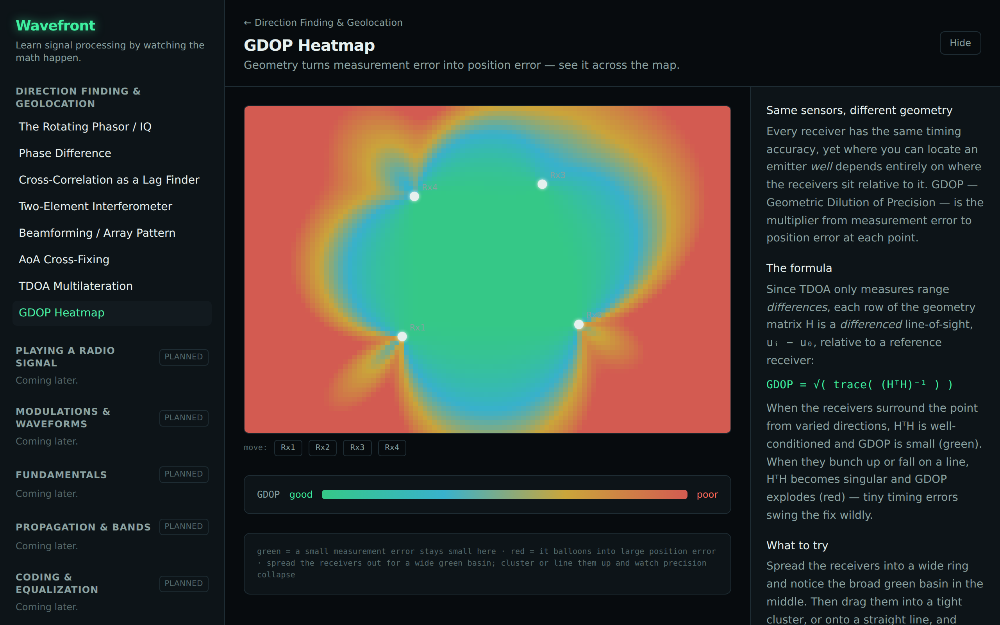
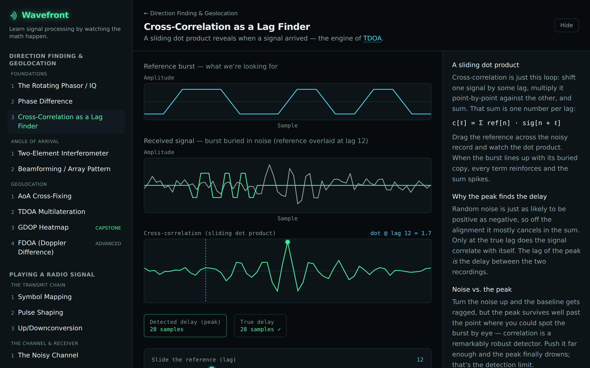
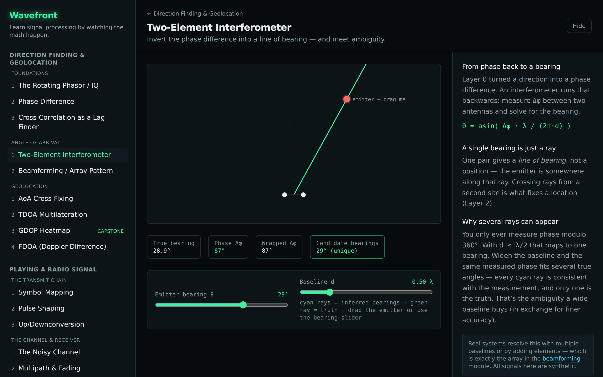
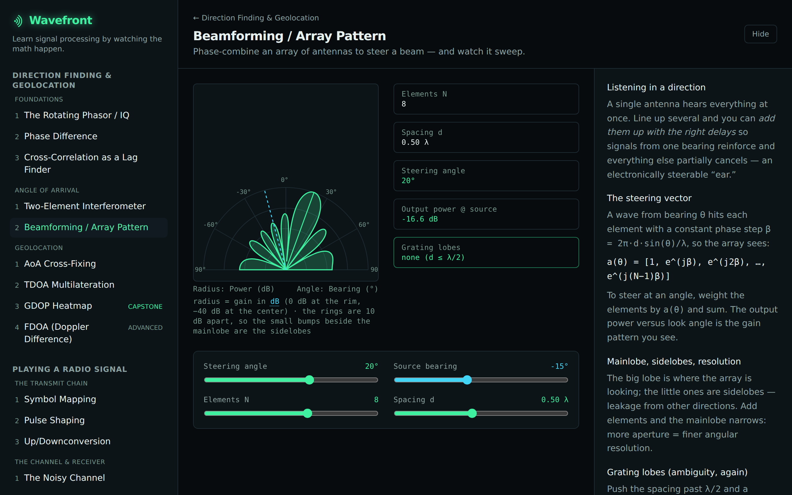
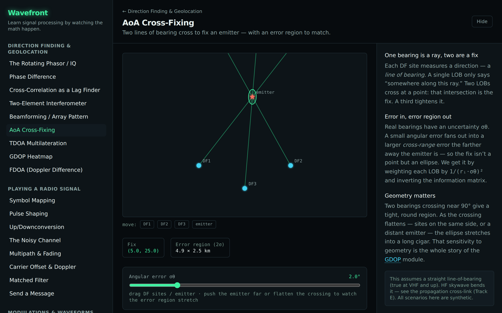
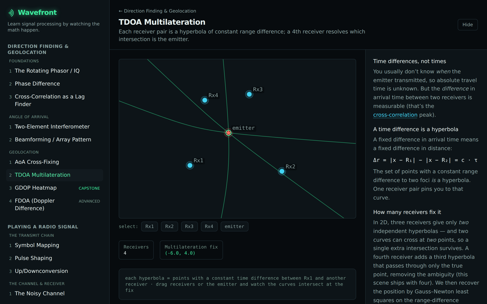

<p align="center">
  
</p>

<p align="center"><strong>Learn signal processing by watching the math happen.</strong></p>

<!--
  Hero shot. The static GDOP heatmap is the documented fallback; the intended hero is a short GIF of
  a live interaction (drag a receiver, watch the precision field repaint). Swap it in here once GIF
  capture is wired into the screenshot pipeline. Both the wordmark above and this shot come from
  `npm run screenshots`, so they never drift from the app. The mark is explained in docs/brand.md.
-->



Wavefront is an interactive, visually striking web app that teaches DSP to **strong software
engineers who are not electrical engineers**. Its seven tracks take you from a signal as a
rotating vector all the way to direction finding, the full radio chain, and channel coding —
every transform built **from scratch** (no black-box libraries) and checked against reference
values by the test suite, so you can read and trust the math.

> The signature interaction is **direct manipulation**: drag the emitter, drag a receiver,
> sweep a slider — and watch _everything_ recompute and animate in real time. That live
> feedback loop is the soul of the tool.

## What it is / who it's for

If "IQ", "phase", or "the complex plane" feel hand-wavy to you, this is built for you.
Everything is explained in software-developer analogies:

- A **filter** is just a function applied to a stream of samples.
- **Convolution / correlation** is a sliding dot product.
- The **FFT** is a change of basis — re-expressing a vector in different coordinates.
- An **IQ sample** is a 2D vector (a complex number); a signal is an array of them.

## Gallery

_Marquee scenes are captured automatically (`npm run screenshots` → `docs/images/`)._ **v1 ships
all seven tracks**; the scenes below walk the **Direction Finding & Geolocation** track from the
rotating phasor up to the live GDOP map, and the overview map shows the full curriculum.

|                                                                 |                                                           |
| --------------------------------------------------------------- | --------------------------------------------------------- |
|            |  |
|  |              |
|             |            |


## Quickstart

```bash
npm install
npm run dev      # start the app (Vite dev server)
```

Then open the printed local URL.

## What you can learn (track / module map)

| Track                               | What it answers                                                      | Status |
| ----------------------------------- | -------------------------------------------------------------------- | ------ |
| **Direction Finding & Geolocation** | How do you find where a transmitter is?                              | 🚢 v1  |
| **Playing a Radio Signal**          | What happens when you send data over the air, end to end?            | 🚢 v1  |
| **Modulations & Waveforms**         | Every modulation scheme's fingerprint, side by side.                 | 🚢 v1  |
| **Fundamentals**                    | Why does any of this work? Sampling, filtering, FFT, channelization. | 🚢 v1  |
| **Signal Chain & SDR**              | Where do the IQ samples come from? The analog↔digital boundary.      | 🚢 v1  |
| **Propagation & Bands**             | The RF physics around the signal (bands, line-of-sight, skywave).    | 🚢 v1  |
| **Coding & Equalization**           | How do you make the link survive a real channel?                     | 🚢 v1  |

See [`docs/tracks/`](./docs/tracks/) for the per-track curriculum.

## Architecture

Wavefront is designed to grow into a broad "learn DSP from the ground up" platform. New modules
and tracks slot in via a **module registry** — adding curriculum is a registry entry, not a
routing rewrite. See **[docs/ARCHITECTURE.md](./docs/ARCHITECTURE.md)** for the full contract
and step-by-step recipes.

## Tech stack

- **React + TypeScript + Vite**, **Tailwind** (v4) for layout, design tokens for the
  "lab-instrument" aesthetic.
- **Canvas 2D** for the plots, world map, and the GDOP heatmap (a coarse sampled field — fast
  enough without WebGL); **react-three-fiber / Three.js** held in reserve for genuinely 3D moments.
- **Web Audio API** for the audible-signal moments.
- **Zustand** for lightweight state.

## Testing & the from-scratch-core philosophy

The DSP math is implemented **from scratch** in `src/dsp/` — no black-box library does the
conceptually interesting work (a fast FFT lib is acceptable only as an optimization behind a
from-scratch reference the tests check against). The `dsp/` core is covered by
**numerical-correctness tests** (Vitest): known inputs → known outputs, reference-vs-optimized
agreement, Parseval/energy checks, correlation-peak-at-known-lag, and closed-form spot checks.
An independent correctness audit re-derived every `dsp/` and `propagation/` primitive against
closed-form and textbook references — see **[docs/AUDIT.md](./docs/AUDIT.md)**.

The Propagation & Bands track adds a sibling from-scratch module, `src/propagation/` — RF _physics_
(wavelength, bands, the radio horizon, skywave/MUF), deliberately kept **out** of the `dsp/` core and
covered by its own closed-form tests (`λ = c/f`, the geometric horizon, the secant-law MUF).

```bash
npm test            # run the suite
npm run test:coverage
npm run build       # type-check + production build
npm run lint
npm run format
npm run screenshots # regenerate docs/images via Playwright
```

## Scope

Public, **unclassified, textbook-level** DSP/RF theory only (Wikipedia / undergraduate-textbook
depth). No proprietary algorithms, real-world system parameters, or anything resembling CUI or
export-controlled material. **All example signals are synthetic.** This keeps the project freely
shareable.

## License & contributing

[MIT](./LICENSE). Contributions welcome — see [CONTRIBUTING.md](./CONTRIBUTING.md).
