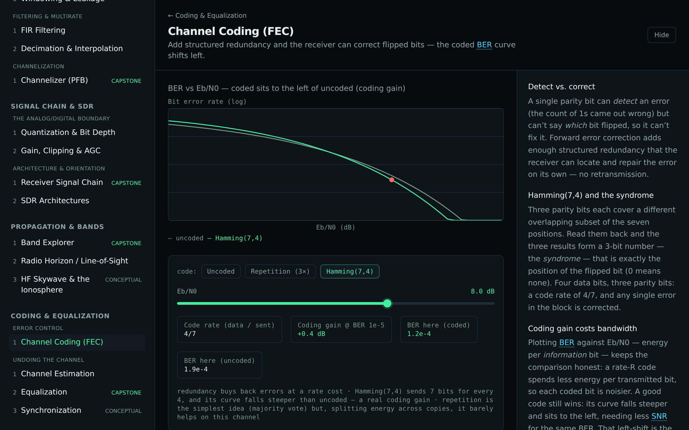
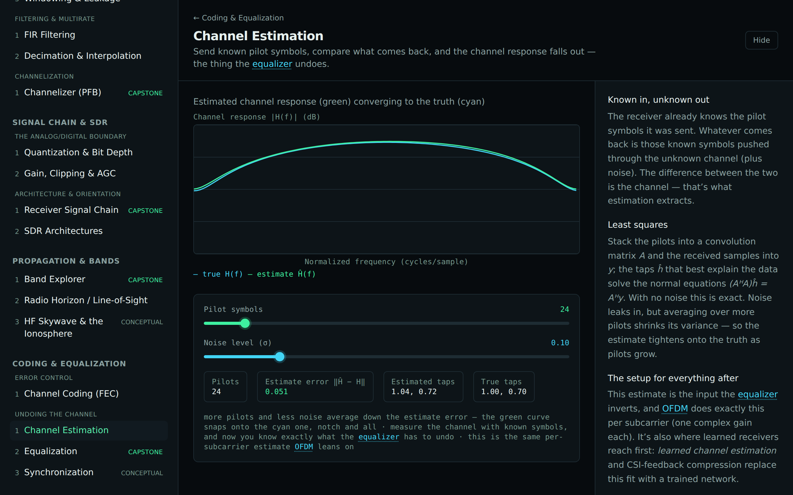
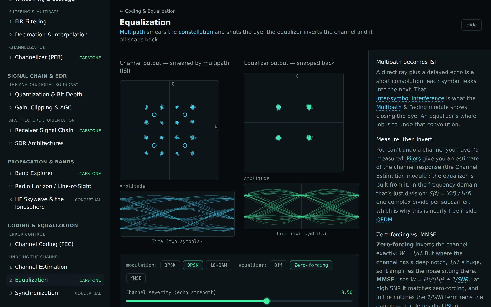
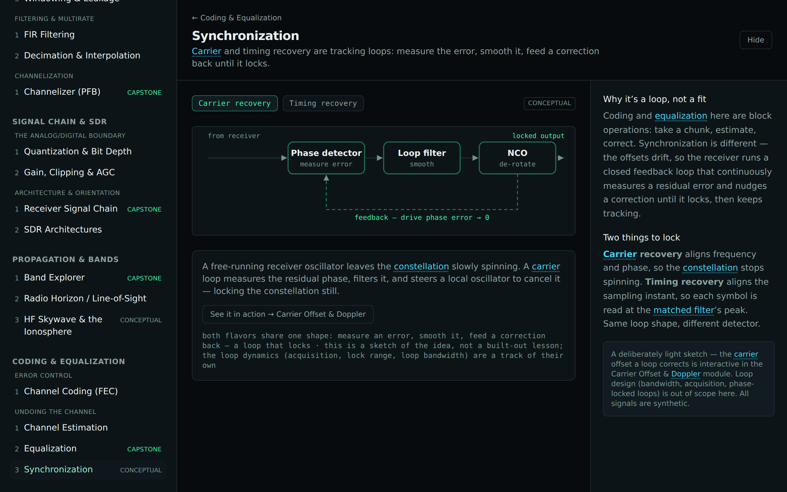

# Track G — Coding & Equalization

The motivating question for a non-EE: _once a signal has been sent, distorted, and noised, how do you
get the message back?_ Two families of technique recover the link — add **structured redundancy** so
flipped bits can be corrected (channel coding), and **measure and undo** what the channel did to the
waveform (estimation + equalization). It builds directly on the noisy-channel and multipath/ISI work
of the Playing a Radio Signal track.

Built as a layered curriculum — each layer is a prerequisite for the next. **Equalization is the
capstone**: the multipath-smeared constellation that snaps back when the channel is inverted.

## Error Control

| Module                   | Intuition                                                                     | Status      |
| ------------------------ | ----------------------------------------------------------------------------- | ----------- |
| **Channel Coding (FEC)** | Structured redundancy corrects flipped bits; the coded BER curve shifts left. | ✅ shipping |

## Undoing the Channel

| Module                 | Intuition                                                                      | Status        |
| ---------------------- | ------------------------------------------------------------------------------ | ------------- |
| **Channel Estimation** | Known pilots reveal the channel response; the estimate converges to truth.     | ✅ shipping   |
| **Equalization**       | Invert the channel — the smeared constellation snaps back and the eye reopens. | ✅ capstone   |
| **Synchronization**    | Carrier/timing recovery as tracking loops (a conceptual sketch).               | 🟡 conceptual |

## The DSP behind it

From-scratch and fully tested (see [`docs/dsp/`](../dsp/)):

- [Channel coding](../dsp/coding.md) — repetition + Hamming(7,4), syndrome decoding, and the analytic
  coding-gain curves.
- [Channel estimation & equalization](../dsp/equalization.md) — pilot least-squares estimation,
  zero-forcing / MMSE equalizers, and an adaptive LMS equalizer.

## The ML throughline

This track is the natural **ML-in-RF sandbox**, teed up but not built:

- **LMS is gradient descent on error** — the conceptual ancestor of a learned (neural) equalizer.
  Swap the linear adaptive filter for a bigger function approximator trained on the same error signal
  and you have a neural equalizer.
- Where classical methods strain — nonlinear distortion, hard-to-model channels, joint
  estimation+equalization — is exactly where learned receivers, learned channel estimation, and
  CSI-feedback compression are an active research frontier.
- It's the same hand-crafted-vs-learned-features step the **Modulation Classifier** makes. This is
  where you'd plug in ML.

> The receiver here is block-based; carrier/timing tracking loops (synchronization) are only sketched.
> The BER curves are standard closed-form approximations. All signals are synthetic.
