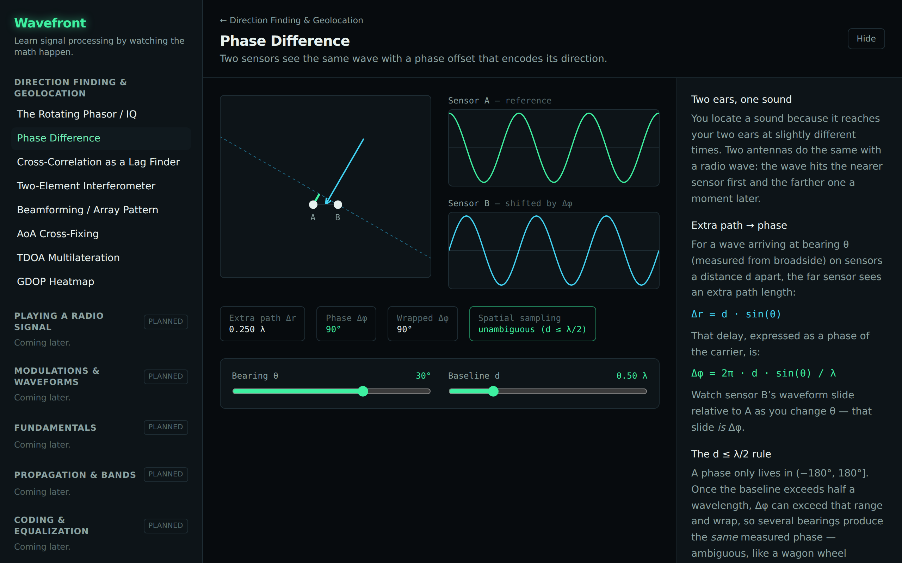

# Track A — Direction Finding & Geolocation

The v1 ship target (brief §4). The motivating arc: a non-EE arrives wanting to understand
"how do you find where a transmitter is?", and the curriculum walks them down to phasors and
back up to a live GDOP map.

Built as a layered curriculum — each layer is a prerequisite for the next.

## Layer 0 — Primitives

| Module                                | Intuition                                                                   | Status      |
| ------------------------------------- | --------------------------------------------------------------------------- | ----------- |
| **Rotating phasor / IQ**              | A complex sample is just a 2D point, and a signal spins it.                 | ✅ shipping |
| **Phase difference**                  | Two sensors see the same wave with a phase offset that encodes direction.   | ✅ shipping |
| **Cross-correlation as a lag finder** | A sliding dot product reveals _when_ a signal arrived (the engine of TDOA). | ✅ shipping |

## Layer 1 — Angle of Arrival (AoA)

| Module                          | Intuition                                                                           | Status             |
| ------------------------------- | ----------------------------------------------------------------------------------- | ------------------ |
| **Two-element interferometer**  | Path-length difference → phase difference → bearing (and ambiguity when `d > λ/2`). | ✅ shipping        |
| **Beamforming / array pattern** | Steer a uniform linear array and watch the gain pattern sweep.                      | ✅ shipping        |
| MUSIC super-resolution          | The noise subspace resolves two emitters beamforming smears together.               | planned (advanced) |

## Layer 2 — Geolocation (marquee scenes)

| Module                   | Intuition                                                                     | Status         |
| ------------------------ | ----------------------------------------------------------------------------- | -------------- |
| **AoA cross-fixing**     | Two lines of bearing intersect to a fix; error regions elongate with range.   | ✅ shipping    |
| **TDOA multilateration** | Each receiver pair defines a hyperbola of constant range difference.          | ✅ shipping    |
| **GDOP heatmap**         | Geometry turns measurement error into position error — see it across the map. | ✅ shipping v1 |
| **FDOA**                 | Doppler-difference isodoppler curves from a moving platform.                  | ✅ shipping    |

> These scenes assume a straight line-of-bearing to the emitter (true at VHF and up). The
> HF-skywave wrinkle is the cross-link from Track E (§8).
