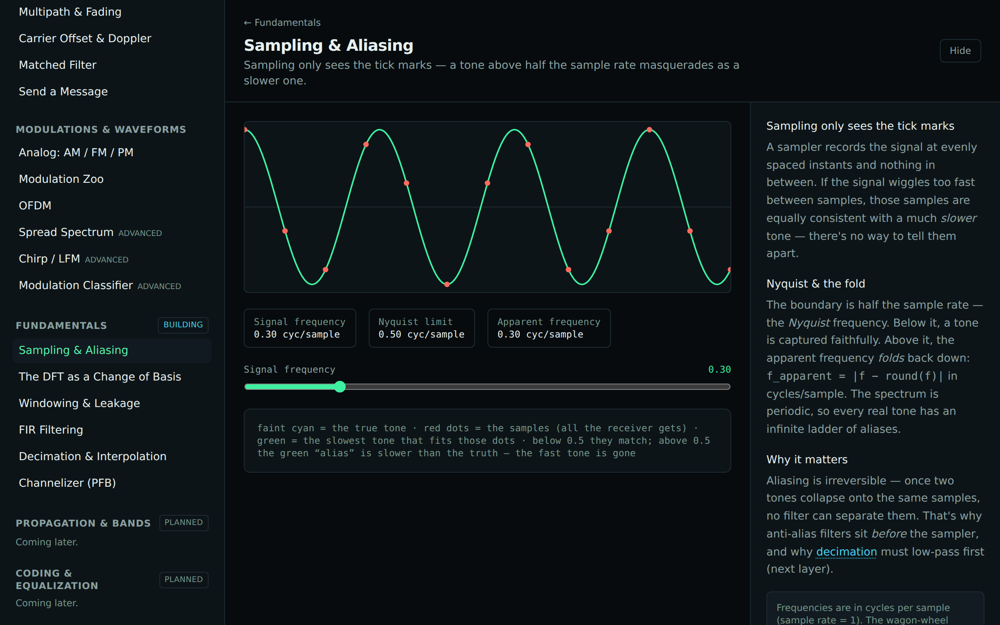
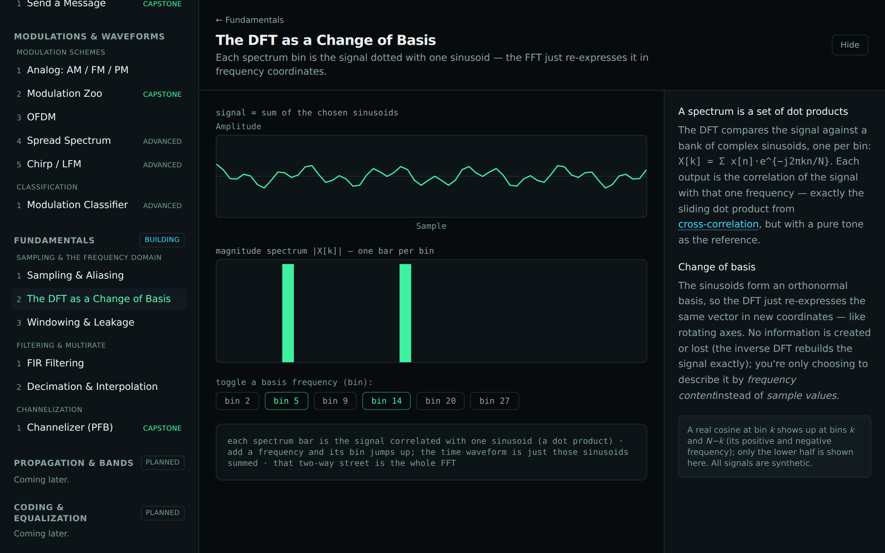
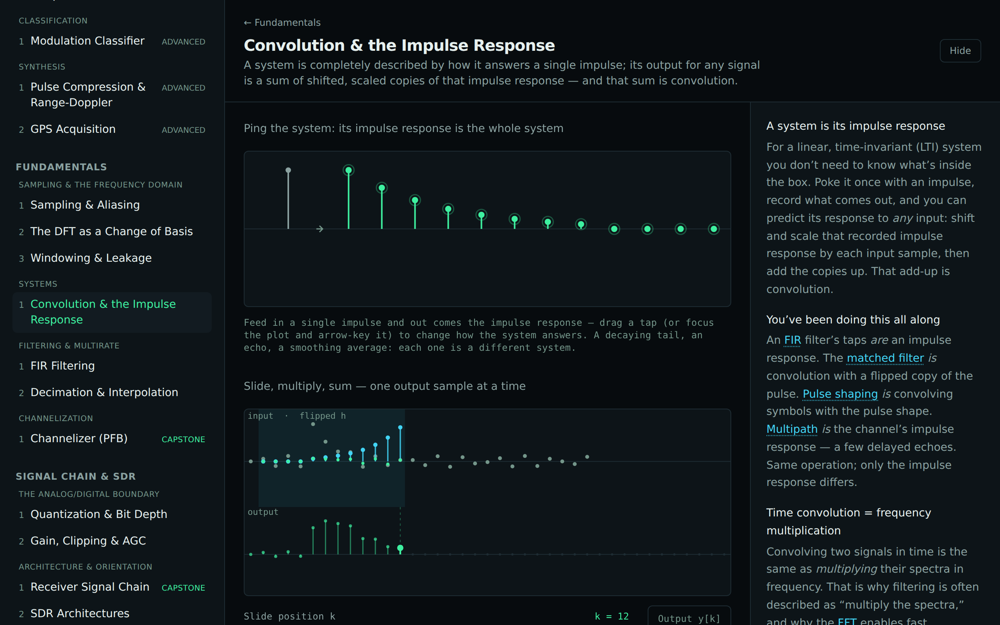
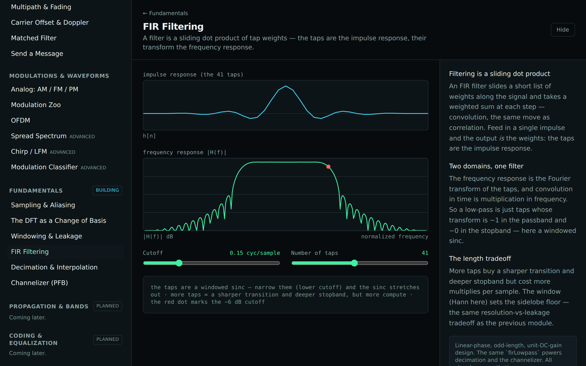
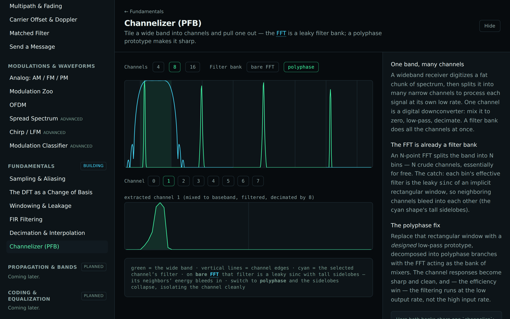

# Track D — Fundamentals

Conceptually this track comes _first_ — sampling, the FFT, convolution, filtering, and multirate
underpin everything in A–C. It's built later because those tracks already forced most of its
primitives into existence; here that machinery gets consolidated and named. For a learner it answers
"why does any of this actually work?" — and its marquee, the **channelizer**, is how a wideband
receiver pulls many signals out of one digitized band.

## Layer 0 — Sampling & the frequency domain

| Module                           | Intuition                                                                       | Status      |
| -------------------------------- | ------------------------------------------------------------------------------- | ----------- |
| **Sampling & Aliasing**          | Sampling only sees the tick marks; tones above Nyquist fold down (wagon-wheel). | ✅ shipping |
| **The DFT as a Change of Basis** | Each spectrum bin is the signal dotted with one sinusoid.                       | ✅ shipping |
| **Windowing & Leakage**          | Taper a block to trade mainlobe width for sidelobe level.                       | ✅ shipping |

## Layer 1 — Systems

| Module                                 | Intuition                                                                          | Status      |
| -------------------------------------- | ---------------------------------------------------------------------------------- | ----------- |
| **Convolution & the Impulse Response** | A system _is_ its impulse response; any output is a sum of shifted, scaled copies. | ✅ shipping |

> The organizing idea under the filtering layer: an FIR filter's taps _are_ an impulse response, the
> matched filter _is_ convolution with a flipped pulse, and multipath _is_ a few-tap echo response —
> same operation, only `h` differs. One tested `convolve` primitive backs this module and the
> filtering ones (it precedes them on purpose). All signals are synthetic.

## Layer 2 — Filtering & multirate

| Module                         | Intuition                                                             | Status      |
| ------------------------------ | --------------------------------------------------------------------- | ----------- |
| **FIR Filtering**              | A sliding dot product of taps; impulse response ↔ frequency response. | ✅ shipping |
| **Decimation & Interpolation** | Change the sample rate — but low-pass first, or aliasing/images bite. | ✅ shipping |

## Layer 3 — Channelization (marquee)

| Module                | Intuition                                                                        | Status      |
| --------------------- | -------------------------------------------------------------------------------- | ----------- |
| **Channelizer (PFB)** | Tile a band into channels; the FFT is a leaky filter bank, a PFB makes it sharp. | ✅ shipping |

> The bank is built from one `channelize` whose prototype is swapped (rectangle = bare FFT, designed
> windowed-sinc = polyphase) — the cleanest way to _see_ why PFB wins. All signals are synthetic.
