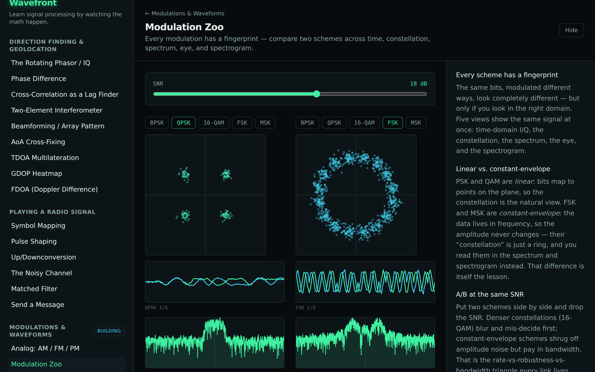
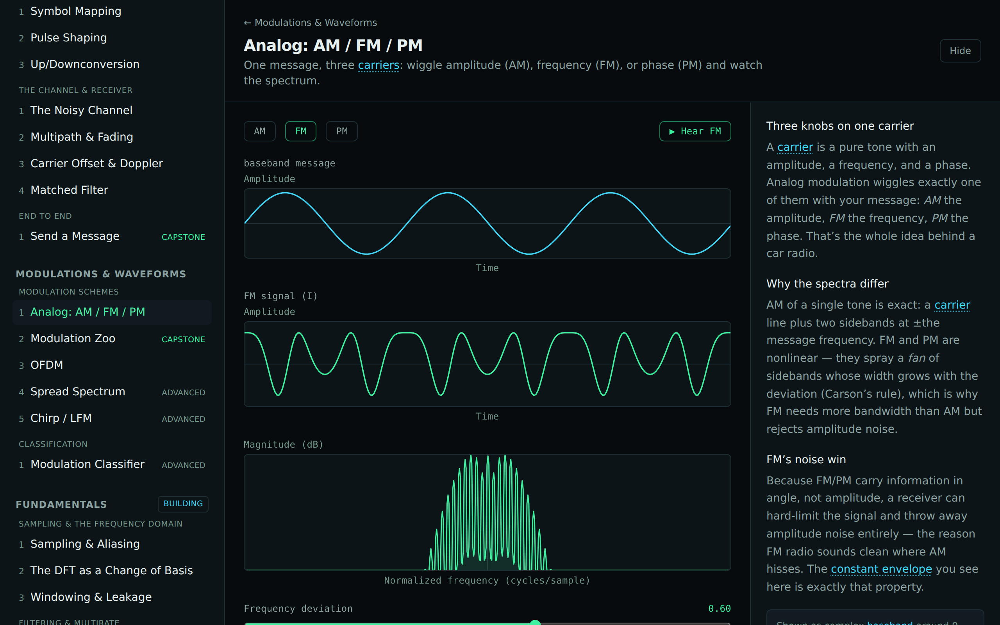
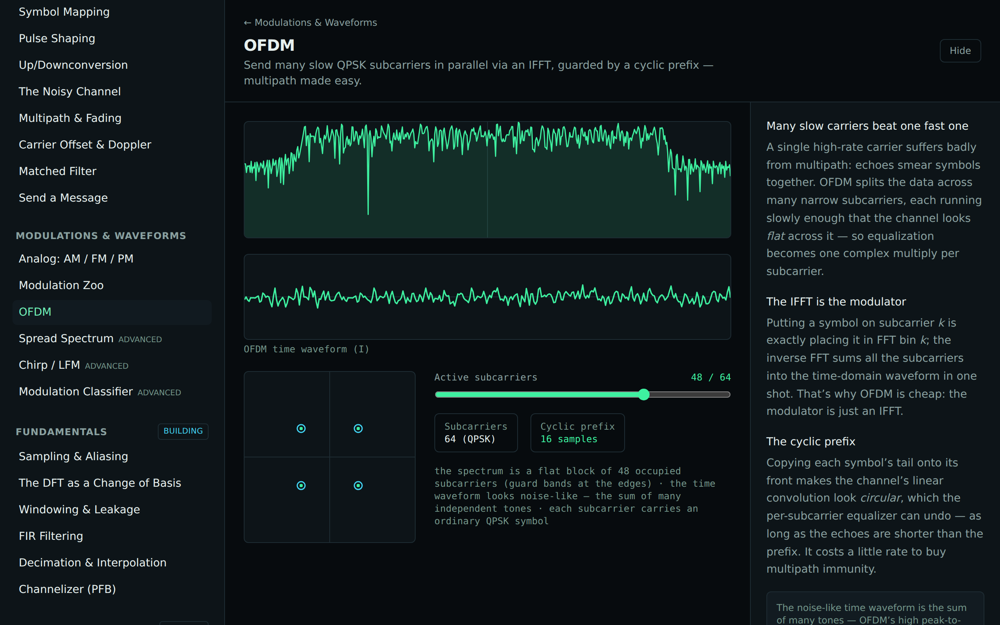
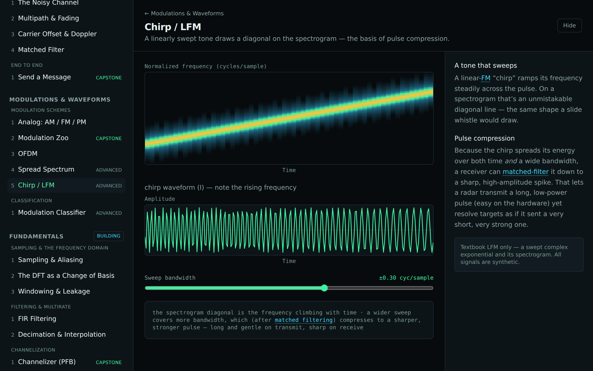

# Track C — Modulations & Waveforms

Modulation is the most visual content in the project: every scheme has a distinct fingerprint across
time-domain I/Q, spectrum, constellation, eye, and spectrogram. Rather than an encyclopedia, this
track leans on the pluggable `Modulator` interface (from Track B's design note) so coverage scales by
adding strategies, and spends the effort on a few explorer/comparison surfaces.

The landscape in three tiers: **analog** (AM/FM/PM), **digital keying** (PSK/QAM linear + FSK/MSK
constant-envelope), and **waveform-level systems** (OFDM, spread spectrum, chirp) that are
compositions of the primitives.

## Modules

| Module                    | Intuition                                                                       | Status      |
| ------------------------- | ------------------------------------------------------------------------------- | ----------- |
| **Analog: AM / FM / PM**  | One message, three carriers — wiggle amplitude, frequency, or phase.            | ✅ shipping |
| **Modulation Zoo**        | A/B two schemes across five synchronized views (the marquee).                   | ✅ shipping |
| **OFDM**                  | Many slow QPSK subcarriers via IFFT + cyclic prefix; multipath made easy.       | ✅ shipping |
| **Spread Spectrum**       | A PN code smears data wide and low, then de-spreads it back (processing gain).  | advanced    |
| **Chirp / LFM**           | A swept tone draws the spectrogram diagonal; pulse compression.                 | advanced    |
| **Modulation Classifier** | Identify an unknown scheme from a few features (envelope, spread, I/Q balance). | advanced    |

> Linear schemes (PSK/QAM) read on the constellation; constant-envelope schemes (FSK/MSK) read in
> frequency — the track surfaces that distinction directly. Web Audio for the analog on-ramp is a
> planned follow-up. All signals are synthetic.
