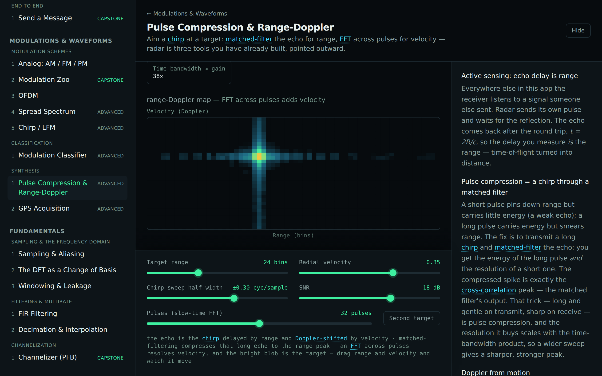
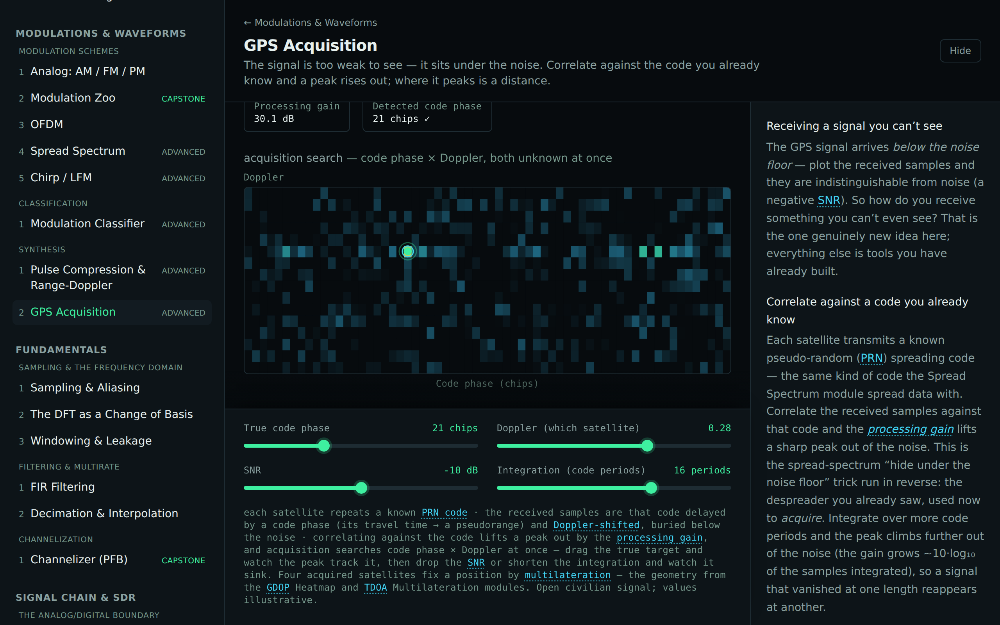

# Track C — Modulations & Waveforms

Modulation is some of the most visual content in the project: every scheme has a distinct fingerprint across
time-domain I/Q, spectrum, constellation, eye, and spectrogram. Rather than an encyclopedia, this
track leans on the pluggable `Modulator` interface (from Track B's design note) so coverage scales by
adding strategies, and spends the effort on a few explorer/comparison surfaces.

The landscape in three tiers: **analog** (AM/FM/PM), **digital keying** (PSK/QAM linear + FSK/MSK
constant-envelope), and **waveform-level systems** (OFDM, spread spectrum, chirp) that are
compositions of the primitives. Closing **synthesis** scenes then aim those primitives outward.

## Modules

| Module                                | Intuition                                                                                                     | Status      |
| ------------------------------------- | ------------------------------------------------------------------------------------------------------------- | ----------- |
| **Analog: AM / FM / PM**              | One message, three carriers — wiggle amplitude, frequency, or phase.                                          | ✅ shipping |
| **Modulation Zoo**                    | A/B two schemes across five synchronized views (the marquee).                                                 | ✅ shipping |
| **OFDM**                              | Many slow QPSK subcarriers via IFFT + cyclic prefix; multipath made easy.                                     | ✅ shipping |
| **Spread Spectrum**                   | A PN code smears data wide and low, then de-spreads it back (processing gain).                                | advanced    |
| **Chirp / LFM**                       | A swept tone draws the spectrogram diagonal; pulse compression.                                               | advanced    |
| **Modulation Classifier**             | Identify an unknown scheme from a few features (envelope, spread, I/Q balance).                               | advanced    |
| **Pulse Compression & Range-Doppler** | Aim the chirp outward: matched-filter the echo for range, FFT pulses for speed.                               | advanced    |
| **GPS Acquisition**                   | The signal is under the noise — correlate against the known code and a peak rises; where it peaks is a range. | advanced    |

> Linear schemes (PSK/QAM) read on the constellation; constant-envelope schemes (FSK/MSK) read in
> frequency — the track surfaces that distinction directly. The analog on-ramp is audible (AM
> tremolo vs FM/PM vibrato) via Web Audio. The two closing synthesis scenes are where these waveforms
> are pointed at a target: **pulse compression** is the chirp through a matched filter, and an FFT
> across pulses paints a **range-Doppler map** — the radar cousin of the GDOP heatmap — while **GPS
> acquisition** pulls a spreading-code signal out from under the noise floor and reads range off the
> correlation peak, searching code phase × Doppler on the same 2D surface (drawn with the same shared
> component). Both recombine tools from across the app rather than opening a new field. All signals are
> synthetic and illustrative.
