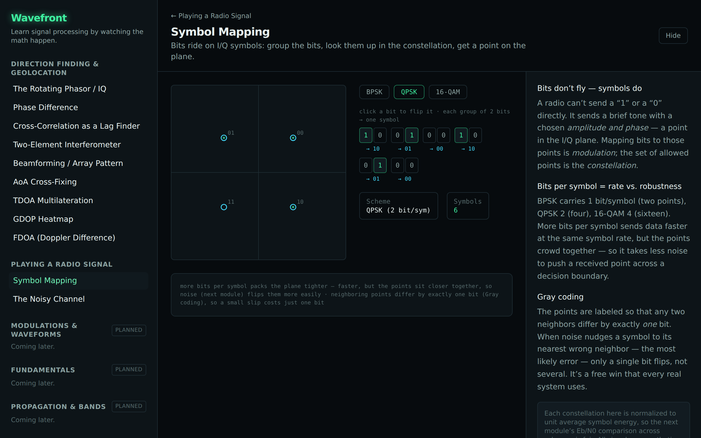
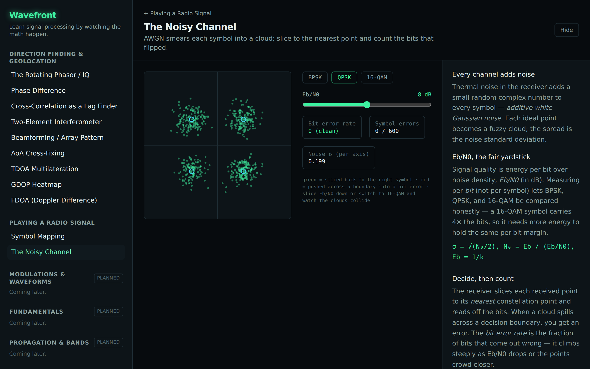

# Track B — Playing a Radio Signal

The motivating question for a non-EE: _what actually happens when you send data over the air?_ The
track follows one message down the chain — bits become I/Q symbols, cross a noisy channel, and get
sliced back to bits — so the abstract "modem" becomes a sequence of concrete, draggable steps.

Built as a layered curriculum — each layer is a prerequisite for the next.

## Layer 0 — The transmit chain

| Module             | Intuition                                                                        | Status      |
| ------------------ | -------------------------------------------------------------------------------- | ----------- |
| **Symbol Mapping** | Bits ride on I/Q symbols: group the bits, look them up in the constellation.     | ✅ shipping |
| Pulse Shaping      | Turn discrete symbols into a band-limited waveform; the raised cosine kills ISI. | planned     |
| Up/Downconversion  | Mix baseband onto a carrier and back — the spectrum slides, the bits don't.      | planned     |

## Layer 1 — The channel & receiver

| Module                | Intuition                                                                          | Status      |
| --------------------- | ---------------------------------------------------------------------------------- | ----------- |
| **The Noisy Channel** | AWGN smears each symbol into a cloud; slice to the nearest point, count the flips. | ✅ shipping |
| Matched Filter        | Correlate against the pulse to pull symbols out of noise (max SNR sampling).       | planned     |

## Layer 2 — End to end

| Module         | Intuition                                                                      | Status  |
| -------------- | ------------------------------------------------------------------------------ | ------- |
| Send a Message | Wire the whole chain: text → bits → symbols → channel → receiver → text + BER. | planned |

> These scenes are hard-decision and symbol-synchronous (no timing/carrier recovery yet) — those
> wrinkles arrive in the Fundamentals and Coding & Equalization tracks. All signals are synthetic.
