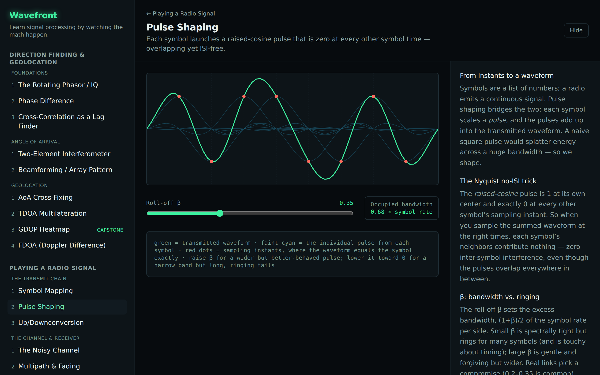
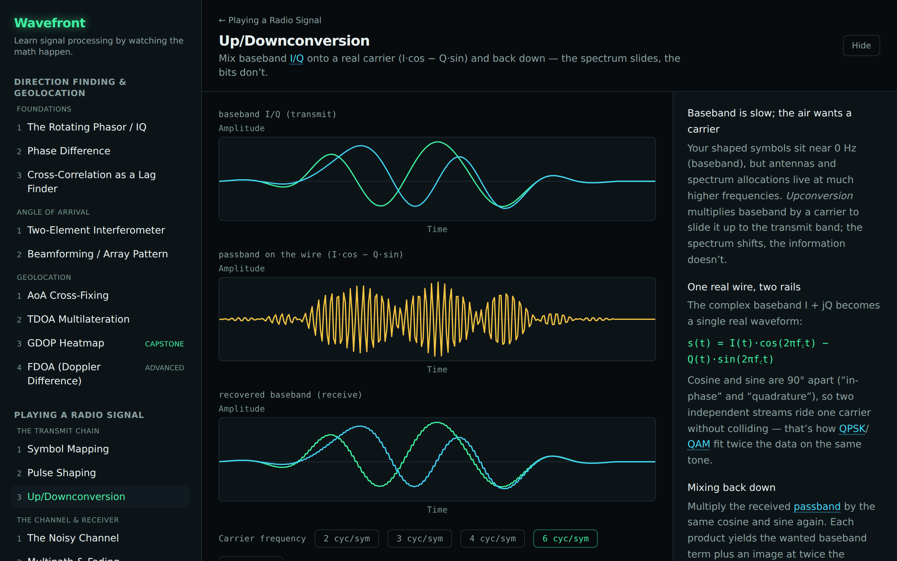
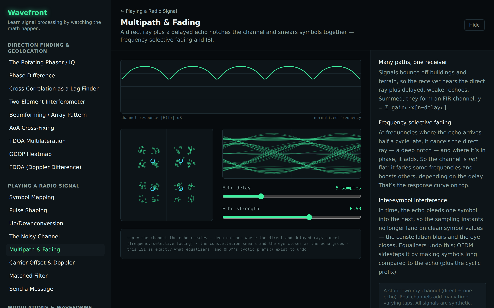
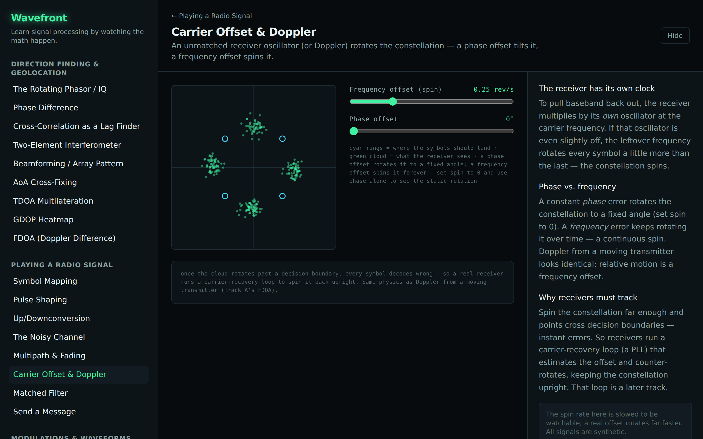
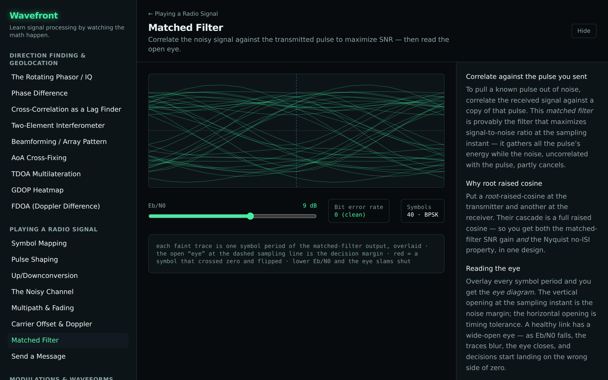
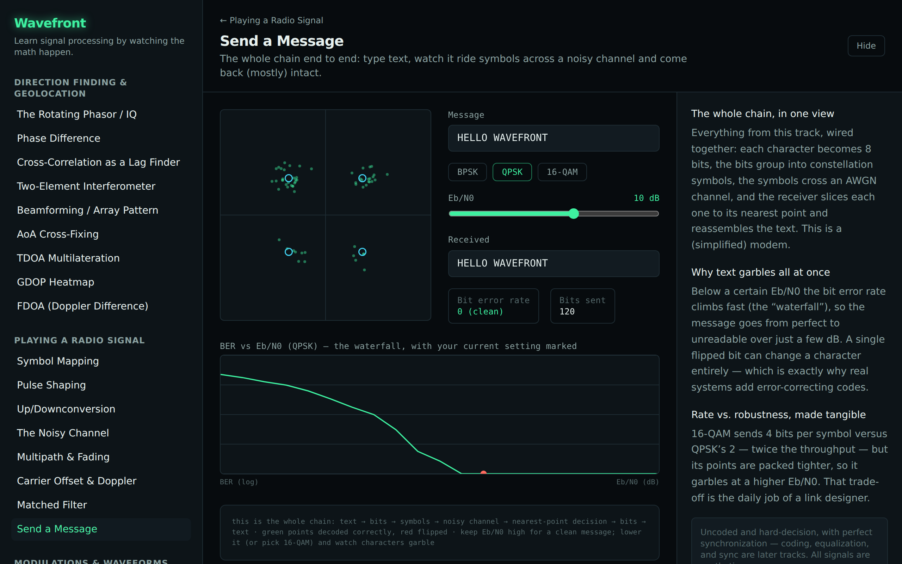

# Track B — Playing a Radio Signal

The motivating question for a non-EE: _what actually happens when you send data over the air?_ The
track follows one message down the chain — bits become I/Q symbols, cross a noisy channel, and get
sliced back to bits — so the abstract "modem" becomes a sequence of concrete, draggable steps.

Built as a layered curriculum — each layer is a prerequisite for the next.

## Layer 0 — The transmit chain

| Module                | Intuition                                                                        | Status      |
| --------------------- | -------------------------------------------------------------------------------- | ----------- |
| **Symbol Mapping**    | Bits ride on I/Q symbols: group the bits, look them up in the constellation.     | ✅ shipping |
| **Pulse Shaping**     | Turn discrete symbols into a band-limited waveform; the raised cosine kills ISI. | ✅ shipping |
| **Up/Downconversion** | Mix baseband onto a carrier and back — the spectrum slides, the bits don't.      | ✅ shipping |

## Layer 1 — The channel & receiver

| Module                       | Intuition                                                                          | Status      |
| ---------------------------- | ---------------------------------------------------------------------------------- | ----------- |
| **The Noisy Channel**        | AWGN smears each symbol into a cloud; slice to the nearest point, count the flips. | ✅ shipping |
| **Multipath & Fading**       | A direct ray plus a delayed echo notches the channel and smears symbols (ISI).     | ✅ shipping |
| **Carrier Offset & Doppler** | An unmatched oscillator (or Doppler) rotates/spins the constellation.              | ✅ shipping |
| **Matched Filter**           | Correlate against the pulse to pull symbols out of noise (max SNR sampling).       | ✅ shipping |

## Layer 2 — End to end

| Module             | Intuition                                                                                           | Status      |
| ------------------ | --------------------------------------------------------------------------------------------------- | ----------- |
| **Send a Message** | The whole chain: text → bits → symbols → channel → receiver → text, with a live BER-vs-Eb/N0 curve. | ✅ shipping |

> The receiver is hard-decision; carrier recovery (undoing the Carrier-Offset spin) and equalization
> (undoing multipath ISI) are their own later track. All signals are synthetic.
