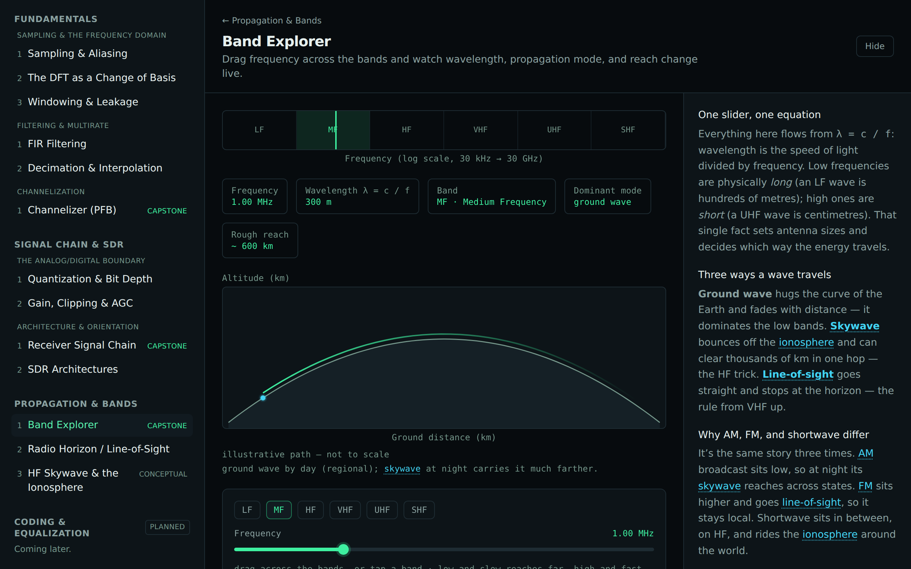
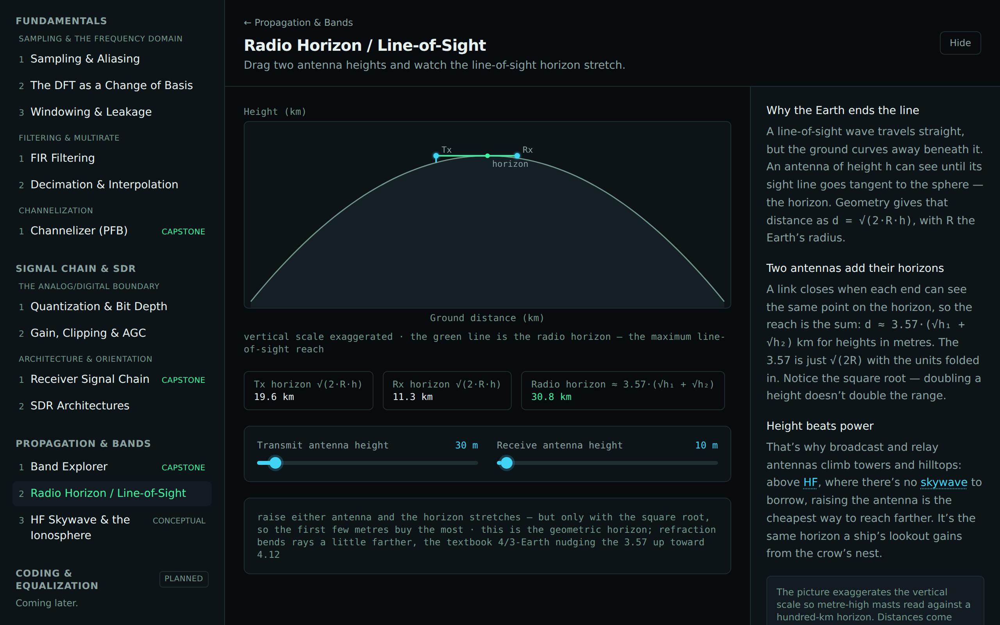
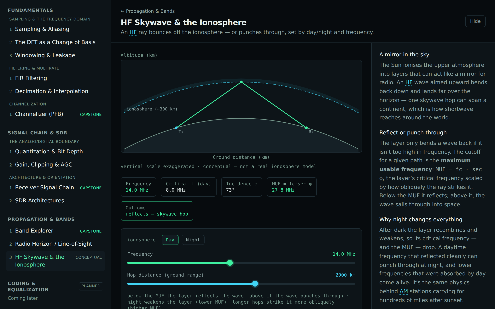
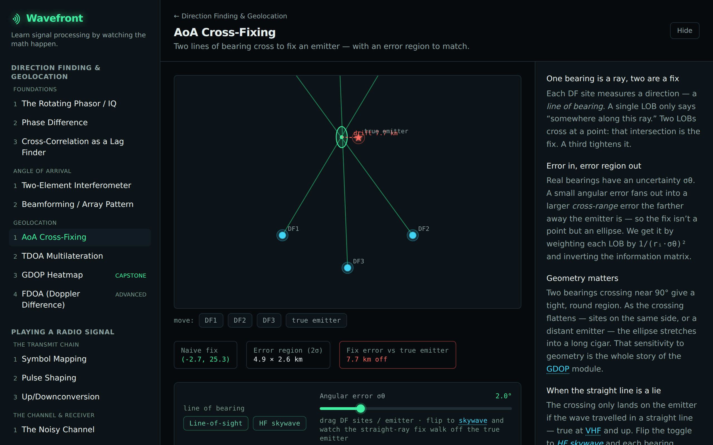

# Track E — Propagation & Bands

A deliberately **lean context companion**, not a DSP peer track. Tracks A–D/F are DSP — math
transforming sample arrays. Propagation is _RF physics_: how energy crosses a medium **before** it
becomes samples. So its math lives outside the from-scratch `dsp/` core, in a separate
[`propagation/`](../propagation/) module, and its visuals are bands, ray paths, horizons, and
ionospheric layers — not FFTs and constellations.

It answers the question a non-EE actually has about the air around the signal: _why does AM reach
across states at night, FM stay local, and shortwave go global?_

## Layer 0 — Bands & Reach

| Module                            | Intuition                                                                                    | Status      |
| --------------------------------- | -------------------------------------------------------------------------------------------- | ----------- |
| **Band Explorer** _(capstone)_    | Drag frequency across the bands; watch `λ = c/f`, the propagation mode, and reach change.    | 🚩 marquee  |
| **Radio Horizon / Line-of-Sight** | Above HF, range is mostly antenna height: `d ≈ 3.57·(√h₁ + √h₂)` km, on a curved Earth.      | ✅ shipping |
| **HF Skywave & the Ionosphere**   | A ray reflects off the ionosphere or punches through — day/night and frequency decide (MUF). | 🌓 stub     |

The two real interactives are Band Explorer and Radio Horizon; the ionosphere piece is a deliberately
conceptual stub (one layer, illustrative critical frequencies, one hop — no real ionosphere model).

## The cross-link — propagation-aware geolocation

The one place propagation genuinely **changes a DSP answer**, and the strongest reason this track
exists. The geolocation scenes in the Direction Finding & Geolocation track quietly assume a straight
line-of-bearing to the emitter (true at VHF and up). On HF via skywave the wave arrives after an
ionospheric bounce, deflected a few degrees — so a fix built on the straight-line assumption walks
off the true emitter.

The **AoA cross-fixing** scene gets a line-of-bearing toggle (reusing the shared world-map canvas):
flip it from line-of-sight to HF skywave and the naive straight-ray fix drifts off the true emitter,
with the gap drawn live. The deflection comes from the [`propagation/`](../propagation/skywave.md)
module, not a duplicated map.

## New from-scratch physics (in `propagation/`, not `dsp/`)

- [Wavelength & bands](../propagation/wavelength-and-bands.md) — `λ = c/f` and the LF…SHF ladder.
- [Radio horizon](../propagation/radio-horizon.md) — the geometric line-of-sight distance.
- [Skywave & MUF](../propagation/skywave.md) — the conceptual reflect-vs-penetrate rule and the
  illustrative bearing deflection the cross-link uses.

The new [`RayPathDiagram`](../../src/components/plots/RayPathDiagram.tsx) (2D earth-curvature /
ray-path cross-section) is shared by Radio Horizon and the skywave stub.

## Out of scope

No atmospheric simulator, no real ionosphere model, no antenna or link-budget engineering, no system
parameters or frequencies of interest. Strictly textbook-level concepts of bands, horizon, and
skywave. Modes and reaches are illustrative bands, not predictions. All values synthetic.
