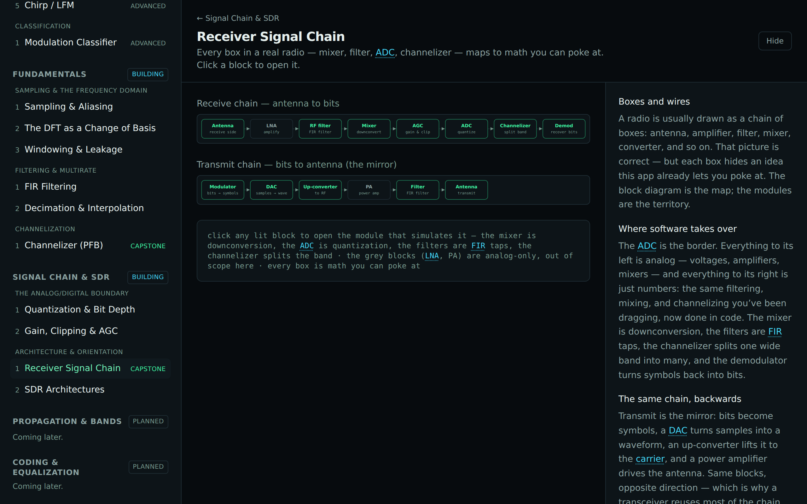

# Track F — Signal Chain & SDR

A lean **companion / orientation** track (built before Track E — track letters are build priority,
not learning order). It does two jobs nothing else covers:

1. Add the genuinely-new effects at the **analog↔digital boundary** — quantization and
   gain/noise-floor — which are where the IQ samples every other track consumes actually come from.
2. **Map the physical radio to the math the app already simulates**, via a clickable signal-chain
   block diagram, so a "boxes-and-wires" learner can find the DSP behind each block.

Most "hardware" blocks already have DSP counterparts elsewhere, so this track **links to them** rather
than re-explaining: the mixer/tuner is up/downconversion, the ADC is sampling + this track's
quantization, the anti-alias and IF filters are FIR filtering, and the wideband front end + channelizer
is channelization.

## Layer 0 — The Analog/Digital Boundary

| Module                       | Intuition                                                                                            | Status      |
| ---------------------------- | ---------------------------------------------------------------------------------------------------- | ----------- |
| **Quantization & Bit Depth** | An ADC rounds each sample to one of `2^N` levels — more bits, lower noise floor, more dynamic range. | ✅ shipping |
| **Gain, Clipping & AGC**     | Too little gain buries the signal in noise; too much clips it — AGC hunts the zone between.          | ✅ shipping |

## Layer 1 — Architecture & Orientation

| Module                                 | Intuition                                                                                      | Status      |
| -------------------------------------- | ---------------------------------------------------------------------------------------------- | ----------- |
| **Receiver Signal Chain** _(capstone)_ | Every box in a real radio maps to math you can poke at — click a block to open it.             | 🚩 marquee  |
| **SDR Architectures**                  | Direct-sampling vs. zero-IF vs. superheterodyne: SDR just moves the ADC closer to the antenna. | ✅ shipping |

New from-scratch DSP primitives: [quantizer](../dsp/quantization.md) and
[gain/clipping](../dsp/gain.md). The interactive [`BlockDiagram`](../../src/components/BlockDiagram.tsx)
is reusable and could later double as an app-wide orientation map (behind a flag).

## Out of scope

Amplifier circuit internals, mixer image/spur theory beyond a one-line mention, impedance matching,
RF/PCB/EM design, and register-level detail — this track stays at the block / sample-domain level. All
signals are synthetic.
